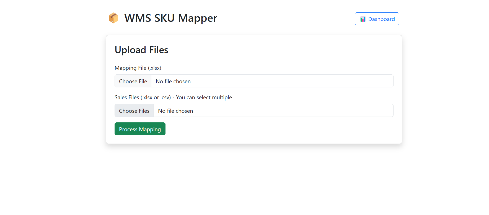
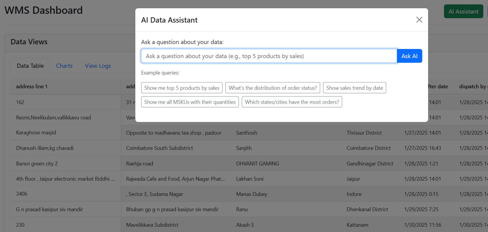

# 📦 Warehouse Management System (WMS) - MVP

This is a complete MVP implementation of the **WMS Assignment** from CSTE, focused on automating SKU-to-MSKU mapping, sales data processing, dashboards, and AI-powered querying.

---

## 🧩 Parts Overview

| Part | Module                              | Tech Stack        | Status |
|------|-------------------------------------|-------------------|--------|
| 1    | SKU to MSKU Mapping (GUI)           | Python, Tkinter   | ✅ Done |
| 2    | Relational Dashboard (Baserow)      |  Airtable | ✅ Done |
| 3    | Web App Integration (Flask)         | Flask, HTML, CSS  | ✅ Done |
| 4    | AI Query Layer + Visualization      | DuckDB, HuggingFace, Matplotlib | ✅ Done |

---

## ✅ Part 1: SKU to MSKU Mapping (GUI)

- Map platform-specific SKUs to MSKUs using a master file.
- Handle combo SKUs like `A+B+C`.
- Export mapped data and error logs.

### 📂 Files:
- `part1_sku_mapping/gui.py`
- `part1_sku_mapping/sku_mapper.py`
- Input/output inside `/data/` and `/static/outputs/`

---

## ✅ Part 2: Dashboard (Relational DB)

- Synced final sales data to **Baserow/Airtable**.
- Real-time visibility for mapped orders, SKUs, and analysis.

---

## ✅ Part 3: Web App Integration

- Built using **Flask** with HTML templates.
- Upload sales + mapping files, see processed outputs.
- Supports download of mapped file and error log.
- Embedded Airtable dashboard.

---

## ✅ Part 4: AI-Powered SQL Layer

- Ask questions in natural language (e.g., "What are top-selling MSKUs?")
- AI model (`defog/sqlcoder`) converts it to SQL.
- Query executed on DuckDB (in-memory).
- Results shown in table/chart automatically.

---

## 🖥️ Demo Preview

  
  

---

## 📁 Folder Structure

WMS-Assignment/
│
├── part1_sku_mapping/
│   └── sku_mapper.py
│   └── gui.py
│   └── data/ (put sales & mapping sheets here)
│
├── part2_database_dashboard/
│   └── airtable_setup.md (or nocodedb/teable setup)
│
├── part3_web_integration/
│   └── frontend/ (for web UI)
│   └── backend/ (optional: Flask/FastAPI to call Python)
│
├── part4_ai_query_layer/
│   └── ai_layer.py
│
├── README.md
└── loom_video.mp4

---

## 🛠 Tech Used

- Python, pandas, openpyxl
- Tkinter (GUI)
- Flask (web app)
- DuckDB (SQL backend)
- HuggingFace Transformers (`sqlcoder`)
- Airtable  (dashboards)
- Matplotlib (charts)

---

## 👨‍💻 Made By

Rohan  
As part of the **WMS MVP Assignment** from CSTE ✨  
April 2025  
